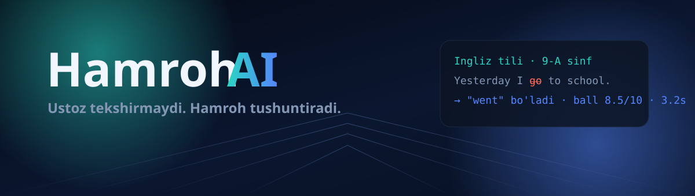
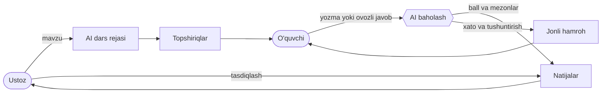

<div align="center">



**Ustoz tekshirmaydi. Hamroh tushuntiradi.**

O'qituvchining tekshiruv vaqtini qaytaradigan va o'quvchi bilan jonli ovozda gaplashadigan AI hamroh.

[](https://nestjs.com)
[](https://react.dev)
[](https://www.typescriptlang.org)
[](https://www.postgresql.org)
[](#-uch-til)
[](LICENSE)

</div>

---

## 🎯 Muammo

Bir sinfning yozma ishini tekshirish ustozning yarim kunini oladi. Izoh uch kundan keyin yetib boradi — o'quvchi savolni ham eslamaydi. Har bir bolaga alohida tushuntirishga vaqt qolmaydi.

**Hamroh AI** shu halqani yopadi: ustoz mavzuni yozadi, AI topshiriq tuzadi, javoblarni mezonlar bo'yicha baholaydi, xatoni o'quvchining o'z tilida tushuntiradi — va o'quvchi u bilan **ovozda** gaplashib, tushunmagan joyini so'raydi.

## ✨ Nima qiladi

| | |
|---|---|
| 🧩 **AI dars rejasi** | Mavzudan maqsad, bosqichlar va topshiriqlar avtomatik tuziladi |
| ⚡ **Avtomatik baholash** | Har bir javob mezonlar bo'yicha ball oladi — soniyalarda, izoh bilan |
| 🔍 **Xatolar tahlili** | Xato fragmenti, to'g'ri varianti va sababi ko'rsatiladi |
| 🎙 **Jonli ovozli sessiya** | O'quvchi mikrofonni bosib savol beradi, Hamroh ovozda javob beradi |
| 🛡 **Ustoz nazorati** | AI qo'ygan bahoni ustoz ko'radi, tuzatadi va tasdiqlaydi |
| 🌍 **Uch til** | Interfeys ham, baholash ham, ovoz ham: o'zbek · rus · ingliz |

Maktab ham, oliy ta'lim ham: 7-sinf matematikasidan OTM oliy matematikasi va dasturlash asoslarigacha.

## 🧠 Qanday ishlaydi



Ovoz zanjiri: `mikrofon → PCM 16 kHz → WebSocket → STT → LLM (function calling) → TTS → brauzer`.

## 🚀 Tez boshlash

**Talablar:** Node.js 20+, PostgreSQL 14+

```bash
git clone https://github.com/Uzprogers/hamroh_ai.git
cd hamroh_ai

cp .env.example .env                        # server kalitlari
cp apps/web/.env.example apps/web/.env.local

createdb hamroh_ai
npm install
npm run migration:run
npm run seed                                # demo ustoz, 6 o'quvchi, dars va baholar

npm run api                                 # http://localhost:3001
npm run web                                 # http://localhost:5173
```

**Kirish parolsiz:** Telegram yoki Google. Hisob bo'lmasa avtomatik yaratiladi — rol va muassasa ma'lumotlari kirgandan keyingi qadamda so'raladi.

<details>
<summary><b>Telegram va Google kirishini sozlash</b></summary>

<br />

- **Telegram** — [@BotFather](https://t.me/BotFather) da bot ochiladi, `TELEGRAM_BOT_TOKEN` va `TELEGRAM_BOT_USERNAME` `.env` ga yoziladi. Server `getUpdates` bilan tinglaydi, shuning uchun botda webhook o'rnatilmagan bo'lishi kerak. Kalitlar bo'sh bo'lsa Telegram tugmasi "sozlanmagan" deydi, ilova ishlashda davom etadi.
- **Google** — Google Cloud Console → OAuth client → *Authorized JavaScript origins* ga `http://localhost:5173` (va prod domeningiz) qo'shiladi. `GOOGLE_CLIENT_ID` va `VITE_GOOGLE_CLIENT_ID` bir xil bo'lishi shart. Origin ro'yxatda bo'lmasa Google `400: origin_mismatch` qaytaradi.

</details>

## 🔑 Muhit o'zgaruvchilari

Barcha kalitlar `.env` da va repoga tushmaydi. To'liq shablon — `.env.example`.

| O'zgaruvchi | Vazifasi |
|---|---|
| `DATABASE_URL` | PostgreSQL ulanishi |
| `JWT_SECRET` · `JWT_EXPIRES_IN` | Token imzosi va muddati |
| `LLM_API_KEY` · `LLM_MODEL` · `LLM_BASE_URL` | Fikrlash modeli (OpenAI-mos API) |
| `YANDEX_SERVICE_ACCOUNT_KEY_PATH` · `YX_FOLDER_ID` | Nutq xizmati: kalit **fayl yo'li**, faylning o'zi repoda emas |
| `GOOGLE_CLIENT_ID` | Google orqali kirish |
| `TELEGRAM_BOT_TOKEN` · `TELEGRAM_BOT_USERNAME` | Telegram orqali kirish |
| `WEB_ORIGIN` | CORS uchun ruxsat etilgan manzillar (vergul bilan) |

Frontend: `VITE_API_URL`, `VITE_WS_URL`, `VITE_GOOGLE_CLIENT_ID`.

## 🏗 Arxitektura

```
apps/
  api/                        NestJS · DDD qatlamlari
    src/libs/
      identity/               JWT · Google · Telegram · rol · til
      education/              guruh · dars · topshiriq · javob · baho · analitika
      agent/                  LLM (stream + function calling + JSON rejim)
      speech/                 IAM · STT · TTS
      session/                WS gateway · pipeline · agent tool'lari
    src/migrations/           qo'lda yozilgan TypeORM migratsiyalari
  web/                        React 19 · Vite · Tailwind · three.js
    src/features/             landing · auth · teacher · student · session
    src/i18n/                 uz · ru · en lug'ati
```

Har bir modul `config → application (dto/services) → infrastructure → presentation` tartibida. `synchronize: false` — sxema faqat migratsiya orqali o'zgaradi.

## 🔒 Xavfsizlik

- `.env`, `key.json`, `*.key.json`, loglar va `dist/` — `.gitignore` da; repoda birorta ham kalit yo'q
- Nutq xizmati kaliti faqat serverda, **fayl yo'li** orqali ulanadi; IAM token 50 daqiqada avtomatik yangilanadi
- Har bir so'rovda egalik tekshiriladi: mijozdan kelgan `id` ishonchsiz, metama'lumot bazadan olinadi
- Parollar `bcrypt` bilan, sessiya `JWT` bilan; Google tokeni serverda `aud` bo'yicha tekshiriladi
- CORS faqat `WEB_ORIGIN` ro'yxatidagi manzillarga ochiq

## 🌍 Uch til

Interfeys, AI javoblari, baholash izohlari va ovoz bir vaqtda almashadi: **o'zbek · rus · ingliz**. Til foydalanuvchi profilida saqlanadi.

## 🗺 Yo'l xaritasi

- [x] Ustoz ↔ o'quvchi halqasi: dars → topshiriq → baho → analitika
- [x] Jonli ovozli sessiya (STT · LLM · TTS)
- [x] Google va Telegram orqali kirish, rol tanlash onboarding
- [ ] Ustoz uchun sinf kesimida chuqur analitika
- [ ] Mobil ilova
- [ ] Maktab va OTM tizimlariga integratsiya

## 👥 Jamoa

**UZPROGERS** — Umummilliy AI Xakaton, Qarshi bosqichi · ta'lim treki.

## 📄 Litsenziya

[MIT](LICENSE)
